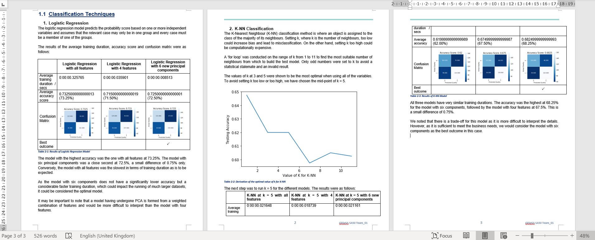

# nus-iss

CA_Project_2 (Term 2) co-authored with members of SA50 Team 1

- Build and evaluate performance of machine learning models using Python
  - Understand popular machine learning models such as k-nearest neighbors, random forest, logistic regression, k-means, naïve Bayes and artificial neural network
  
  
Data Source: https://www.kaggle.com/uciml/red-wine-quality-cortez-et-al-2009

The techniques used in our report included:
 - Linear Regression
 - Logistic Regression
 - K-Nearest Neighbors
 - Decision Tree
 - Neural Network
 - K-Means
 - Hierarchical Clustering

My Scope of Work: Logistic Regression and K-Nearest Neighbors

