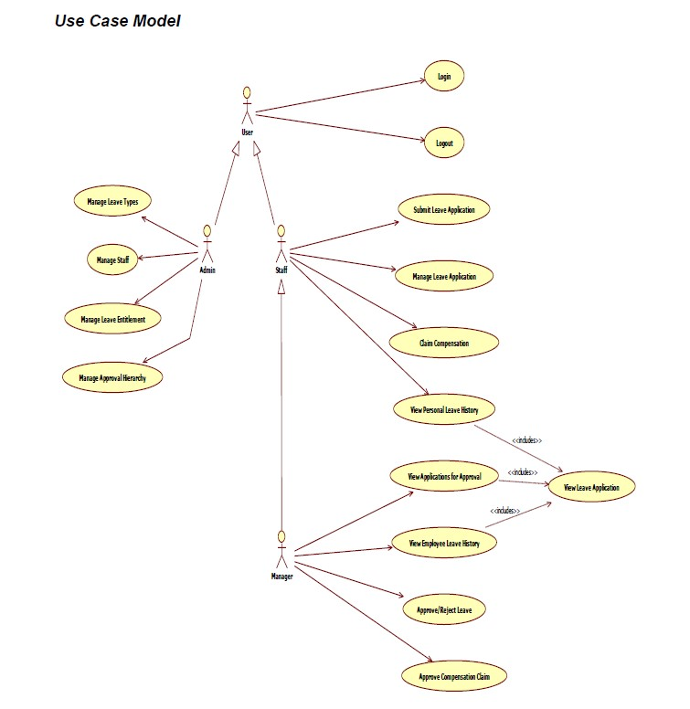
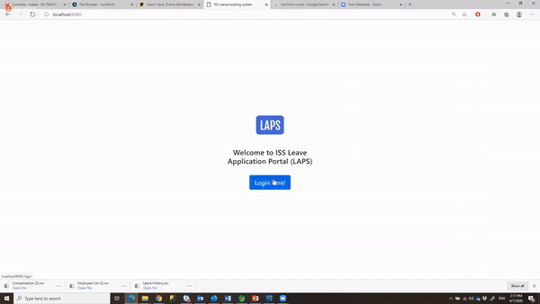

# nus-iss

CA_Project_3 (Term 2) co-authored with members of SA50 Team 1
- Apply knowledge gained from Java Programming, Advanced Java and Building Enterprise Application using J2EE modules
  - Develop a Leave Application Processing System that meets all required functionalities and caters for error handling
- Programming Language: Java
- Development Environment: Spring Tool Suite/Eclipse

- Project Overview:

My Scope of Work: Employee Feature - Personal Leave Overview and Personal Leave History

